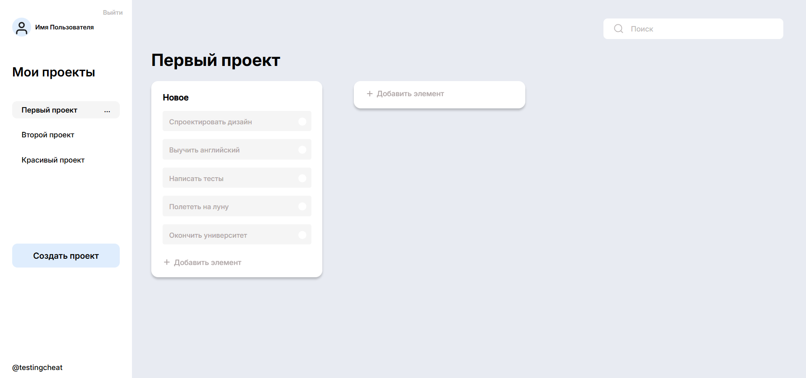

# Фронтенд для сервиса по ведению задач и командных проектов

Фронт веб-приложения с досками (проектами), колонками и карточками внутри. Сделано в качестве пет-проекта

## Основные модули

1. Меню со списком проектов. При нажатии на каждый проект открывается его поле со списком колонок и их карточками. У проекта можно посмотреть список пользователей (при нажатии - удалить их)
2. Кнопка "Создать проект" - вызов модального окна с текстовым полем для названия проекта
3. Поле с колонками и карточками внутри. У каждой карточки можно отметить выполнение, внутри колонки добавить новые
4. Шаблон поисковой строки (для работы нужен бэк)

## Основные технологии

1. Сборка на Vite
2. React TypeScript
3. Библиотека для React @mui/material: Popover, Modal, TextField

### Дизайн

https://www.figma.com/design/9VwkGmiTp3294dI8MCqnG0/%D0%B7%D0%B0%D0%B4%D0%B0%D1%87%D0%BD%D0%B8%D0%BA?node-id=0-1&p=f&t=hnhop8XFjx9ma7d5-0

### Проект опубликован с использование GitHub Pages

https://anastasia-develop.github.io/ProjectPet/

### Примечание

Проект реализован без Бэкенд части, поэтому функционал сильно урезан. Файлы с примером данных, которые должны приходить с бэка лежат внутри public. При перезагрузке страницы данные сохраняться не будут

тг:
@testingcheat